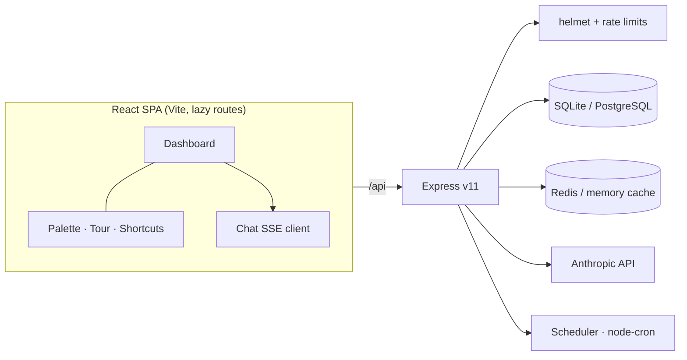

# 📊 Data Analysis Bot v20.1 — First 10 Seconds

React dashboard + AI chat + **Insights Engine** + quality scores + multi-file + shareable reports + custom branding + scheduled reports + team workspaces — now parsing the files Thai shops *actually* export.

---

## Quick Start

```bash
# Install all (monorepo)
npm install

# Backend only
cd backend && npm install

# Frontend only  
cd frontend && npm install
```

### Dev (hot-reload both)
```bash
# From root
npm run dev
# Backend: http://localhost:3000
# Frontend: http://localhost:5173 (proxies API to 3000)
```

### Production
```bash
cd frontend && npm run build    # builds to frontend/dist/
cd ../backend && npm start      # serves dist/ + API on :3000
```

### Docker
```bash
cp .env.example .env
docker compose up -d
# http://localhost:3000
```

---

## Features

| Feature | Detail |
|---|---|
| **⚡ Instant Demo (v20.1)** | Public no-auth landing demo: tap a sample → full Insights Engine results with zero AI calls, cached in-process. The messy Thai sample doubles as a live v20 showcase, and the AI-report slot becomes the conversion CTA |
| **🧹 Messy File Layer (v20)** | TIS-620/UTF-16 encoding detection, delimiter sniffing (`;` tab `\|`), banner-row/header detection, Thai numbers (`฿1,234.50`, `(500)`, `๑๒๓`), พ.ศ. → ค.ศ. dates (`14 ม.ค. 2569`), date columns no longer masquerade as numeric. 45 new tests |
| **React Dashboard** | Vite + Tailwind + Recharts |
| **AI Chat** | Chat with your dataset context |
| **Auto Charts** | 5 chart types, auto-recommended |
| **Smart Prompts** | 8 context-aware suggestions per dataset |
| **Quality Score** | 0–100 score (A–F grade), 5 dimensions |
| **🧠 Insights Engine (v9)** | Deterministic ranked findings — missing-data hotspots, outliers, duplicates, ID columns, correlations, trends. Zero AI cost, instant, unit-tested |
| **🌙 Dark Mode (v9)** | Class-based Tailwind dark theme across every screen, charts included (was a dead toggle before v9) |
| **🛡️ Security (v9)** | helmet CSP headers, global API rate limiting (was imported-but-unused), rate-limited exports, share passwords via header, JWT fail-fast in prod, file-type filter on dataset uploads |
| **Multi-file** | Upload up to 10 files as one dataset |
| **Shareable Reports** | Public links, password-protect, expiry |
| **Custom Branding** | Per-workspace color, logo, name |
| **Scheduled Reports** | Cron-based PDF/Excel delivery |
| **Team Workspaces** | Owner / Admin / Member roles |
| **PostgreSQL + SQLite** | Unified pool, zero-config local dev |
| **Redis + Memory Cache** | Profile, history, analysis caching |
| **Per-user Rate Limits** | Anon 30/15min, Auth 100/15min — enforced on ALL /api routes since v9 |
| **Streaming Parser** | O(1) memory, any file size |
| **Pino Logging** | JSON prod, pretty dev, request IDs |
| **OpenAPI/Swagger** | `/api/docs` interactive |
| **Monitoring** | `/api/metrics` — p50/p95/p99 |
| **Docker + CI/CD** | unit → integration → build → deploy |
| **99 checks** | 35 unit + 35 integration + 29 live smoketest, all green |

---

## Project Structure

```
dab-v9/
├── backend/
│   ├── src/
│   │   ├── server.js                  ← 455-line Express server
│   │   ├── auth.js                    ← JWT access + refresh
│   │   ├── stats.js / stats.test.js   ← 21 unit tests
│   │   ├── analyze.js                 ← Stats pipeline
│   │   ├── export.js                  ← PDF + Excel
│   │   ├── integration.test.js        ← 32 integration tests
│   │   ├── testApp.js                 ← Test app factory
│   │   ├── db/
│   │   │   ├── pool.js                ← PostgreSQL + SQLite
│   │   │   ├── migrate.js             ← 9-table schema
│   │   │   └── repository.js          ← All queries
│   │   ├── services/
│   │   │   ├── cache.js               ← Redis + memory
│   │   │   ├── streaming.js           ← O(1) parser
│   │   │   ├── insights.js            ← v9 deterministic insights (+tests)
│   │   │   ├── qualityScore.js        ← 0-100 quality scorer
│   │   │   ├── promptSuggestions.js   ← Smart prompts + auto charts
│   │   │   └── scheduler.js           ← Cron report runner
│   │   └── middleware/
│   │       ├── rateLimiter.js         ← Per-user limits
│   │       └── monitoring.js          ← Metrics + errors
│   └── openapi.yaml
├── frontend/
│   └── src/
│       ├── App.jsx                    ← Router + Nav
│       ├── store/index.js             ← Zustand store
│       ├── components/
│       │   ├── ui/                    ← Button, Card, Modal, Toast, QualityRing
│       │   ├── charts/                ← AutoChart, CorrelationHeatmap
│       │   ├── dashboard/             ← Main analysis view
│       │   ├── chat/                  ← AI chat panel
│       │   └── workspace/             ← Teams, branding, schedules
│       └── pages/
│           ├── AuthPage.jsx
│           ├── HistoryPage.jsx
│           └── SharePage.jsx          ← Public branded report viewer
└── docker-compose.yml                 ← App + PostgreSQL + Redis
```

---

## Tests

```bash
cd backend
npm test                   # 35 unit tests (stats + insights)
npm run test:integration   # 33 integration tests
npm run test:all           # all 68 tests
npm run test:smoke         # 28 checks vs a REAL running server (see script header)
npm run benchmark          # perf: 100 / 1k / 10k rows
```

---

## API Endpoints (v7–v9)

| Method | Path | Description |
|---|---|---|
| POST | /api/analyses/:id/share | Create public share link |
| GET | /api/public/share/:token | View shared report (no auth) |
| GET | /api/shares | My shared reports |
| DELETE | /api/shares/:id | Revoke share |
| POST | /api/datasets | Create dataset (multi-file) |
| GET | /api/datasets/:id | Get dataset |
| GET | /api/workspaces | My workspaces |
| POST | /api/workspaces | Create workspace |
| GET | /api/workspaces/:id | Workspace + members |
| PATCH | /api/workspaces/:id/branding | Update branding |
| POST | /api/workspaces/:id/members | Invite member |
| DELETE | /api/workspaces/:id/members/:uid | Remove member |
| GET | /api/workspaces/:id/schedules | List schedules |
| POST | /api/workspaces/:id/schedules | Create schedule |
| DELETE | /api/workspaces/:id/schedules/:id | Delete schedule |
| POST | /api/analyses/:id/chat | AI chat message |
| GET | /api/analyses/:id/chat | Chat history |

---

## v9 Changelog (from v8)

### 🐛 Fixed (real bugs found in v8)
| Bug | Impact |
|---|---|
| `apiLimiter` imported but never mounted | General API routes had **no rate limiting at all** — now every `/api` route enforces anon 30 / auth 100 per 15 min (with `optionalAuth` first so logged-in users get the higher quota) |
| Dark mode toggle did nothing | Tailwind config was missing `darkMode: "class"` and zero `dark:` variants existed — now fully themed (~200 dark classes), including Recharts axes/tooltips and the correlation heatmap |
| Charts tab always empty | Frontend passed a hardcoded `[]` as `sampleRows` and the backend never returned them — analyze responses now include `sampleRows` and the chart renders |
| Dataset uploads accepted any file type | `/api/datasets` had no `fileFilter` (exe/zip/anything) — now CSV/Excel only, same as `/api/analyze` |
| Export endpoints unlimited | CPU-heavy PDF/Excel generation had zero rate limits (easy DoS) — now behind the analyze limiter |
| Version chaos | v5 (openapi) / v7 (README, UI, health) / v8 (backend) — everything now reports **9.0.0** |

### 🛡️ Security
- `helmet` with a CSP tuned for the SPA + Swagger UI (verified swagger-ui-express 5.x uses no inline scripts)
- Share passwords sent via `X-Share-Password` header instead of query string (query still works for old links) — keeps passwords out of access logs, proxies, and browser history
- JWT secrets: server refuses to boot in production without real `JWT_SECRET` / `JWT_REFRESH_SECRET` (previously fell back silently to known dev strings)
- `express.json` body limit set explicitly (1 MB)

### ✨ New
- **Insights Engine** (`backend/src/services/insights.js`): 9 rule families → ranked `critical/warning/info/positive` findings in Thai, capped at 12, fully deterministic, 14 unit tests. Ships in every analyze response as `insights[]` + new **Insights tab** in the dashboard
- `/api/health` now reports live `db` and `cache` backends
- Vendor chunk splitting: app JS **674 KB → 76 KB** (react 164 KB + recharts 434 KB cached separately)

### ✅ Verification (all green)
- 35 unit tests (`stats` 21 + `insights` 14)
- 33 integration tests (incl. new security-header + insights-shape checks)
- 28 live-server smoketest checks
- Frontend production build clean, 38 dark-mode selectors compiled

---

## v10 Changelog (from v9) — "The Ledger" design system

A ground-up visual identity, not a reskin of defaults. **Concept:** the app audits datasets the way an auditor audits a ledger — so it wears the auditor's material. Ledger paper is the ancestor of the CSV: pale green feint-ruled paper with one red vertical margin rule.

| Element | Choice |
|---|---|
| **Signature** | The red **margin rule** (`#C13B27`) — findings render as auditor's marginalia: severity mark in a literal left margin, rule, then the entry. Echoed in nav active marks, toasts, quality issues, and the loaded-file slip |
| **Palette** | paper `#F2F4EC` · feint rule `#D6DECE` · ink `#1B211D` · stamp green `#2F6B4F` · rule red `#C13B27` · pencil amber `#B7791F`. Dark mode = "after-hours ledger" (warm green-black, no neon) |
| **Type** | IBM Plex Sans Thai (full Thai glyph support) + IBM Plex Mono for every figure, tag, and eyebrow — tabular numerals throughout |
| **Structure** | Panels are ledger forms: mono uppercase eyebrow + right-aligned mono meta over a feint rule. Page background carries faint ruled lines. Tabs are ruled underlines. Stats are instrument readouts. Quality grade renders as a double-ruled **stamp** and a tick-marked gauge |
| **Craft** | `prefers-reduced-motion` respected, visible `:focus-visible` rings, aria-labels on icon buttons, thin themed scrollbars, chart + heatmap palettes retuned to the system |

Implementation: the `brand`/`gray` Tailwind scales are overridden at the token level, so the entire existing class vocabulary re-skins itself; components were then restyled structurally (UI kit rewritten; dashboard, chat, auth, history, share, workspace passes). All copy follows say-what-it-does rules ("วิเคราะห์ไฟล์", not "✨ Analyze ↗").

---

## v11 Changelog (from v10) — Onboarding, polish & the power-user layer

### 🚀 Onboarding
- **First-run tour** — spotlight walkthrough over the real UI (4 steps), auto-starts once, replayable from the palette or empty state
- **Empty state** — "open ledger" welcome with a one-click **sample dataset** (bundled CSV shaped so trends, insights, duplicates, and forecasts all fire)
- **Loading skeletons** — analyze, history, chat, and lazy-page fallbacks
- **Error states** — ErrorBoundary recovery card; stream failures fall back silently

### ⌨️ Power-user layer
- **Command palette (Ctrl+K)** — every page + action, searchable in Thai/English, full keyboard navigation
- **Shortcuts** — Ctrl+K palette · Ctrl+U choose file · Ctrl+↵ analyze · ? help · Esc close (never hijacks typing)
- **Undo** — deleting a report shows "เลิกทำ" for 5 s before the server commit (flushes safely on navigation)

### 🤖 AI
- **Streaming responses** — SSE endpoint `POST /api/analyses/:id/chat/stream`; tokens render live, classic endpoint remains as automatic fallback

### 📈 Charts
- **Zoom** via drag-brush on Line/Area/Bar · **Export PNG** (2× canvas) & **SVG**

### ⚡ Performance
- **Route-level code splitting** (React.lazy) — History/Workspace/Auth/Share load on demand, prefetched on nav hover

### 🔐 Security & sessions
- **Log out all devices** — `POST /api/auth/logout-all` revokes every refresh token (+ audit log)

### ♿ Accessibility
- Modal focus trap + Esc + focus restore + dialog ARIA · toasts announce via `aria-live` · tablist/tab roles · skip-to-content link · aria-labels on all icon buttons

### ✅ Verification
- 35 unit + **35 integration** (logout-all ×2) + **29 smoketest** checks — all green

## Architecture



---

## v12 Changelog (from v11) — Intelligence + code-quality refactor

This release added an AI agent **and** paid down the debt from v11's fast iteration. The refactor was driven by a concrete audit; every claim below is measured.

### 🧠 Intelligence
- **Tool-use agent** (`services/agent.js`) — for deep-dive questions the model *queries the computed statistics through tools* (`list_columns`, `get_column_detail`, `get_correlations`, `get_forecasts`) and returns both the answer and the trail of checks it ran. Client is dependency-injected → **9 unit tests with a scripted fake client, no API key needed**. New `POST /api/analyses/:id/agent` + **Deep Dive** tab.
- **Insight-grounded analysis** — the main analysis prompt now includes the deterministic Insights Engine findings as *verified facts*, so the report comments on checked statistics instead of re-deriving them.

### 🧹 Refactor — audit answers (before → after)
| Question | Before | After |
|---|---|---|
| Large "god components"? | dashboard **410 lines** (mixed logic + 6 tabs + markup) | shell **214** + `tabs.jsx` **210** + `AgentPanel` **98**; `server.js` **572 → 483** (auth + export extracted to `routes/`) |
| Duplicated business logic? | analyze pipeline copied in **3 places** (both endpoints + testApp) | one `services/analysisPipeline.js`; tests now exercise the **same** code as prod |
| | grade thresholds inlined **4×** | one `lib/grade.js` (client) — **0** inline ternaries left |
| API calls centralized? | **3** raw `fetch()` outside the store | **0** — all through `lib/api.js` (`getJSON`/`postJSON`/`delJSON`) |
| Efficient state updates? | hot paths subscribed to the **whole** store (re-render on any change) | Nav/shortcuts/chat/useAnalysis use **selectors**; toast no longer re-renders the nav |
| Small & reusable? | logic welded into the component | business logic in `useAnalysis()` hook; panels are focused presentational components |
| Well-tested? | **68** backend, **0** frontend | **117**: 44 unit + 35 integration + 29 smoketest + **9 frontend** (grade + api layer), frontend tests wired into CI |

### 🏗️ New module map
```
backend/src/
  routes/{auth,export}.js        ← extracted from server.js
  services/
    analysisPipeline.js          ← single analyze pipeline (used everywhere)
    agent.js  (+ agent.test.js)  ← tool-use agent, DI client
frontend/src/
  lib/{api,grade}.js  (+ *.test.js)   ← centralized HTTP + one grade source
  hooks/useAnalysis.js                ← all dashboard business logic
  components/dashboard/{index,tabs,AgentPanel}.jsx  ← shell / panels / agent UI
```

---

## v13 — Operational quality: measure it, gate it, watch it over time

The goal of this release is that **a regression cannot reach `main` unnoticed**. Every number below is produced by a script in this repo, and every one of them fails CI when it moves the wrong way.

### 📏 Performance: measured, with targets

| Signal | Where | Target | Actual | Gated? |
|---|---|---|---|---|
| **Bundle — initial payload** | `npm run perf:bundle` | ≤ 89 kB gzip | **80.6 kB** | ✅ CI |
| Bundle — total assets | `npm run perf:bundle` | ≤ 227 kB gzip | 206.6 kB | ✅ CI |
| **API p95 — analyze** | `npm run perf:api -w backend` | ≤ 204 ms | **85 ms** | ✅ CI |
| API p95 — health | " | ≤ 54 ms | 22 ms | ✅ CI |
| Throughput — analyze | " | ≥ 83 req/s | 153 req/s | ✅ CI |
| **Render — LCP** | `src/lib/perf.js` → dev overlay | ≤ 2500 ms | in-browser | ⚠️ measured, not gated |
| Render — analyze span (click → painted) | " | ≤ 4000 ms | in-browser | ⚠️ measured, not gated |
| **Client API p95** (incl. network) | " | ≤ 800 ms | in-browser | ⚠️ measured, not gated |

Render metrics are **honestly ungated**: enforcing them needs a headless browser, which this environment can't install. They're measured client-side, surfaced live in a dev overlay (bottom-left; also on any build with `?perf=1`), and readable via `window.__DAB_PERF__`. Wiring them into CI needs Playwright — the natural next step.

**The measurement immediately paid for itself:** recharts was **112 kB gzip of a 195 kB initial payload (56%)** — downloaded by every visitor even though charts live on two tabs many never open. Two changes (lazy chart tabs + removing the `manualChunks` entry that pinned recharts into the entry graph) cut the **initial payload 195.3 → 80.6 kB gzip, a 59% reduction**. That win is now locked behind a budget.

### 🧪 End-to-end user journeys — `npm run test:e2e`
17 tests that spawn the **real server binary** over real HTTP with a real SQLite file, real multipart uploads and real PDF/XLSX generation (`AI_MOCK=1`, so no API key is needed):
- **A · anonymous:** upload → analyze → insights fire on seeded defects → export PDF (asserts the `%PDF` magic number) → export Excel (asserts the `PK` zip container)
- **B · registered:** register → analyze (persisted) → share behind a password → public view (no password → 401, wrong → 401, correct → 200) → history → delete
- **C · intelligence:** chat persists → deep-dive agent runs real tool checks and returns its trail
- **D · guard rails:** `.exe` upload rejected · security + rate-limit headers present · metrics expose per-route p95

### 📉 Code quality, tracked over time — `npm run coverage && npm run quality`
Dependency-free (no eslint/jscpd/sonar to install or pin). Every run appends to `metrics/history.jsonl` and prints **what changed since the last run**, so a regression is a diff, not a vibe.

| Metric | Budget | Actual |
|---|---|---|
| Largest file | ≤ 327 lines | 284 |
| Max function complexity | ≤ 41 cc | 34 |
| Duplicated code | ≤ 3.18 % | 2.18 % |
| Tests | ≥ 113 | **113** |
| **Backend line coverage** | ≥ 84 % | **86.12 %** |
| Files never loaded by a test | ≤ 32 | 32 |

The budget file is a **ratchet**: `--update` recalculates from the current tree, so floors move up as the codebase improves and can only be relaxed deliberately.

**On coverage honesty:** V8 only instruments files a test actually *loads*, so an unloaded module silently vanishes from the denominator — a coverage number can flatter itself. `scripts/coverage.mjs` therefore also reports every source file no in-process test ever loaded, and CI caps that count. It immediately exposed a real blind spot: `routes/auth.js` and `routes/export.js` (extracted in v12) are never loaded by the integration tests, because `testApp.js` re-implements those routes — they're covered **only** by the E2E suite. Likewise `server.js` is exercised by E2E in a child process V8 can't instrument: tested, but not counted.

### ✅ One command: `npm run verify`
backend tests → frontend tests → E2E → build → bundle budget → coverage → quality gates.
**150 checks green:** 44 unit + 35 integration + 17 E2E + 17 frontend + 29 smoketest + 8 budget gates.

---

## v14 — Render targets are now CI-gated (the Playwright step)

v13 left three render metrics "measured, not gated" because enforcing them needs a real browser. v14 closes that gap.

`scripts/perf-render.mjs` boots the **real server** on the **production build** (`AI_MOCK=1`), drives a **real headless Chromium** through the first-visit journey, and **fails CI** if what the user feels breaches the absolute UX targets in `frontend/perf-budget.json`:

| Metric | Target | Actual | How it's measured |
|---|---|---|---|
| **LCP** (cold visit) | ≤ 2500 ms | **~104 ms** | Chromium's own `largest-contentful-paint`, median of 3 |
| **analyze** (click → report painted) | ≤ 4000 ms | **~170 ms** | harness clock, median of 3 |
| **client API p95** (incl. network) | ≤ 800 ms | **~70 ms** | app's `lib/perf.js`, worst run |

These are **absolute UX budgets**, not machine-local ratchets: LCP 2500 ms is the Web Vitals "good" line, and the others are product promises. A generous absolute target that passes on a slow CI runner is still meaningful; a ratchet on a noisy machine would just flap. The gate is proven to fail on breach and pass when healthy.

### Why no browser download was needed
`@sparticuz/chromium` ships the Chromium binary **inside its npm tarball**, driven by `playwright-core`. So the gate runs in locked-down environments where the Playwright browser CDN is blocked — only system libraries are apt-installed in CI. Point `CHROMIUM_PATH` at a system browser to override.

### The gate caught a real bug on its first run 🐛
Driving the actual UI surfaced a defect the E2E suite had missed: **every file upload from the app was 400ing**. `apiFetch` forced `Content-Type: application/json` on *all* requests — including `FormData` uploads — so `express.json()` tried to parse the multipart boundary as JSON and rejected it. The E2E tests never caught it because they post raw `FormData` directly, bypassing `apiFetch`; only a real browser exercises the true client path.

Fixed at the source (`apiFetch` now drops the JSON content-type for `FormData` bodies, so callers can't accidentally mislabel an upload), with three new regression tests: two unit (`FormData` → no JSON header; JSON → keeps it) and one E2E (a mislabelled upload is a clean 400, not a crash). This is the entire argument for browser-level gating in one incident.

### `npm run verify` (updated)
backend → frontend → E2E → build → **bundle budget → render gate → coverage → quality**.
**Exit 0. 145 checks green:** 44 unit + 35 integration + 19 frontend + 18 E2E + 29 smoketest, behind 4 budget gates (bundle, render×3, API latency, quality×6).

---

## v15 — Killed the last two HIGH CVEs (SheetJS → exceljs)

The oldest debt in the project, flagged since v9: the `xlsx` (SheetJS) package carried **two HIGH-severity advisories with no fix available** — [prototype pollution](https://github.com/advisories/GHSA-4r6h-8v6p-xvw6) and [ReDoS](https://github.com/advisories/GHSA-5pgg-2g8v-p4x9) — in the code path that parses **untrusted user uploads**. That's the worst place to carry an unpatchable vuln. v15 removes it.

### What changed
- **Dependency:** `xlsx` **removed entirely** from the tree; **`exceljs`** (actively maintained, no known advisories) replaces it in all three consumers — the streaming parser (`streaming.js`), the report writer (`export.js`), and the legacy parser (`parser.js`).
- **Parser correctness:** exceljs has an explicit cell-value model, so coercion is done deliberately: Dates → `YYYY-MM-DD`, **formula cells → their computed result** (never the formula text), hyperlinks → visible text, rich text → concatenated runs, error cells (`#DIV/0!`) → treated as missing.
- **The migration caught its own bug.** The parity test found exceljs manufacturing a **phantom column** from a stray cell below the header row (its `columnCount` extends past the header). Fixed by keying column count off the **header row**, matching CSV semantics exactly.

### How the migration was proven safe (this is why v12–v14 existed)
- **Parity, in code:** a real in-memory `.xlsx` produces **byte-identical stats** to the equivalent CSV — same columns, types, missing counts, and aggregates.
- **6 new unit tests** (`streaming.test.js`): CSV/XLSX parity, date coercion, formula→result, the phantom-column guard, error-cells-as-missing, empty-sheet safety.
- **1 new E2E test:** a real `.xlsx` goes upload → analyze → export, and the exported workbook is **re-opened with exceljs** to confirm the sheets exist — end-to-end proof on both read and write.
- **The render gate** re-drove the real UI through the upload journey: unchanged, all targets met.

### New guard so it can't regress — `npm run audit:gate`
A security gate that **fails CI on fixable HIGH/CRITICAL advisories reachable from production code**, with a documented allowlist for reviewed dev-only exceptions (currently just Vite's dev-server advisory, which never ships). Plain `npm audit` is unusable as a gate — it flags dev tooling and unfixable advisories, training everyone to ignore it. This gate fails only on what's *actionable and shipped*, so the class of problem v15 fixed cannot silently return via a transitive dependency.

**Remaining advisories are dev-only** (Vite/esbuild, breaking to fix, never in the production runtime) and explicitly allowlisted with reasons. **Zero HIGH/CRITICAL advisories in shipped code.**

### `npm run verify` (updated)
backend → frontend → E2E → build → bundle → render → coverage → quality → **audit gate**.
**Exit 0. 158 checks green:** 50 unit + 35 integration + 19 frontend + 19 E2E + 29 smoketest, behind 5 gate families (bundle, render×3, API latency, quality×6, security audit).

---

## v16 — Engineering Excellence

The brief was *"I don't want you to build more. I want you to build better."* So this release adds **almost no features**. It fixes the foundations, and it says **no** to one item on its own wish-list.

### 🔨 The flagship fix: the integration tests were a fiction

`testApp.js` **re-implemented 14 routes**. So 35 tests that read like proof of correctness were exercising a *parallel implementation* — `routes/auth.js`, `routes/export.js`, `routes/datasets.js`, `routes/collaboration.js` and both dataset repositories were **never loaded by a single in-process test**.

That gap had already leaked three real bugs into production (v13 error mapping, v14 uploads, and a third found this release). Fixed structurally:

- **`createApp()` factory** (`src/app.js`) — one construction path. `server.js` is now boot-only (30 lines). `testApp.js` shrank from ~200 lines to a **25-line harness** that boots the *real* app. A test double for our own application is now banned (see [ADR-0002](docs/adr/0002-one-app-factory-no-test-double.md)).
- **The moment the fake was removed, a real bug surfaced:** registering a **duplicate username returned `500 Internal Server Error`**. The route tried to detect it with `err.message.includes("already")` — but SQLite says `UNIQUE constraint failed`, so it never matched. Fixed properly with a typed `DuplicateUserError` raised at the repository boundary (which also normalises Postgres `23505` vs SQLite wording).
- **+15 new integration tests** covering the 32 previously-untested dataset/collab routes, including ownership enforcement and cross-user leakage.

**On the coverage number:** it *appears* to fall 86% → 81%. It didn't — the **denominator became real**. The old figure measured ~20 files of a fake app. The honest companion metric improved sharply: **files with no test at all: 32 → 22**, tests 123 → 138.

### 🎭 Playwright: every critical user flow, in a real browser
**11 browser tests** (`npm run test:browser`) against the production bundle and the real server: first-run tour · empty state · upload→analyze→report · insights · lazy-loaded charts · quality grade · **Ctrl+K palette (searching in Thai)** · shortcuts · dark-mode persistence · register · **multi-tool deep-dive agent**.

**It immediately caught a second real bug — mine, from v11.** The onboarding tour **always skipped step 1**: `Tour` checked `if (!rect) → advance` *during render*, before its layout effect could measure, so every user landed on "2 / 4" and never saw the step explaining how to upload a file. Render is now side-effect free and the skip decision lives in `measure()`. The browser test asserts `1 / 4` so it can't regress.

### 📊 Quality dashboard — `npm run dashboard`
`metrics/history.jsonl` was a log nobody read. Now it renders as a self-contained page (`metrics/dashboard.html`): every metric against its budget, with an **inline sparkline per metric and the budget drawn as a dashed red line**, so a slow drift is visible *before* it becomes a breach. No chart library, no build step — open the file.

### 📐 Architecture Decision Records — `docs/adr/`
Six ADRs recording the decisions that were expensive to make: deterministic insights before AI · one app factory · exceljs over SheetJS · ratchets vs absolute budgets · **why not real-time collaboration** · the agent reads stats, never raw rows.

### 🤖 AI agent, multiple tools — verified, not asserted
4 tools (`list_columns`, `get_column_detail`, `get_correlations`, `get_forecasts`), a hard 5-round cap, dependency-injected client. Multi-tool chaining is proven at **three** levels: unit (two `tool_use` blocks in one turn both dispatch), HTTP E2E (the agent returns its trail), and **browser** (the trail renders in the UI: *"ตรวจแล้ว N ขั้น"*).

### 🚫 Real-time collaboration — deliberately **not** built
See **[ADR-0005](docs/adr/0005-no-realtime-collaboration-yet.md)**. It isn't a feature, it's an architecture: WebSockets (losing statelessness), CRDT/OT conflict resolution, presence lifecycle — and a large surface that resists exactly the kind of testing this release exists to strengthen. Meanwhile the product's collaboration is **asynchronous by nature** (comment, @mention, share a report); comments, mentions, notifications, activity feed and share links already cover it. The cheap honest next step, if demand appears, is **polling/SSE for the notification badge** — a fraction of the cost, most of the benefit, statelessness preserved. Building it here would have been *building more*, against the brief.

### ✅ 100% green — `npm run verify` (exit 0)
backend → frontend → E2E → build → **browser** → bundle → render → coverage → quality → security → dashboard.

**149 automated checks:** 50 unit · 50 integration · 19 frontend · 19 HTTP E2E · **11 browser** — plus 29 smoketest checks and **6 gate families** (bundle, render×3, API latency, quality×6, security audit, dashboard), all passing.

---

## v17 — The Cockpit: the browser suite reports on itself

A Playwright suite that only says *pass/fail* throws away everything else it knows. v17 makes it emit `metrics/browser.json` on every run, feeds that into the quality dashboard, and **gates two of the numbers**.

### The six metrics — `npm run test:browser` → `npm run dashboard`
| Metric | Latest | Gated? |
|---|---|---|
| **Playwright pass rate** | 100% (13/13) | ✅ must be **100%** — a broken user flow is never acceptable |
| **Browser console errors** | **0** | ✅ must be **0** — the app may not shout at users |
| Suite duration | ~29 s | tracked (machine-dependent; a flaky time gate trains people to ignore gates — [ADR-0004](docs/adr/0004-budgets-ratchets-vs-absolute.md)) |
| Avg test duration | ~2.2 s | tracked |
| Slowest test | shown by name + ms | tracked |
| Failure screenshots | 0 | tracked |
| Failure traces | 0 | tracked |

**Screenshots and traces are real, not counters.** Every failing test now writes a full-page screenshot *and* a Playwright trace chunk to `artifacts/browser/`. Replay one with `npx playwright show-trace artifacts/browser/<test>.trace.zip` — you get the DOM snapshot, the network log, and a frame-by-frame timeline of the failure. (I verified this by making a test fail: 1 screenshot, 1 trace, both written.)

### Treating console errors as output caught a third real bug 🐛
The suite reported **14 console errors** — errors that had been printing on every page load for seven releases while nobody watched. The cause: **our own CSP was blocking the app's fonts.** `styleSrc` allowed only `'self'` while `index.html` loaded a Google Fonts stylesheet, and there was no `fontSrc` at all. So **IBM Plex Sans Thai and IBM Plex Mono never loaded in production** — the entire Ledger typography, Thai glyphs and tabular numerals included, silently fell back to system fonts. The only symptom was a console error.

The fix was **not** to punch a hole in the CSP for Google. It was to **stop depending on Google**: the fonts are now self-hosted via `@fontsource`, so the CSP stays locked to `'self'`, **no request leaves the user's browser to a third party**, and the app works on locked-down networks and offline.

Two new browser tests keep it honest:
- `document.fonts.check()` asserts the faces are **actually loaded** — a CSS rule naming a font that never downloaded still *looks* right in computed styles, so this is the only assertion that proves it.
- A request interceptor asserts **zero third-party requests** leave the page.

Cost: **+1.2 kB** on the initial payload (81.8 kB gzip). The suite also got *faster* — 50 s → 29 s — because it no longer waits on blocked font requests.

### The bundle metric learned about fonts
`@fontsource` emits one file per (weight × unicode-range), and a browser downloads only the ranges it renders — a Thai user never fetches the Cyrillic file. Summing them into a "total" budget would describe a download **nobody performs**, and would punish correct font practice. Fonts are now their own reported category with their own budget, separate from the code budget. (Importing bare weights instead of subsets also pulled in Cyrillic + Vietnamese: 27 font files and +10 kB of `@font-face` rules. Now 11 files, Thai + Latin only.)

### CI is one cockpit job
`quality-gates` installs Chromium once, then runs: browser suite → bundle → render → API latency → coverage → quality → security → dashboard, and uploads `dashboard.html`, `history.jsonl`, `browser.json`, and any failure screenshots/traces as artifacts. The browser suite **must** run before `quality`, because `quality` gates its metrics.

### ✅ `npm run verify` — exit 0
**151 automated checks:** 50 unit · 50 integration · 19 frontend · 19 HTTP E2E · **13 browser** — behind **8 quality gates** (incl. browser pass rate + console errors), 3 bundle budgets, 3 render targets, API latency budgets, and the security audit gate.

---

## v18 — Boot & shutdown: the two moments nobody tests

A user hit `EADDRINUSE` on `npm run dev` and got a 20-line unhandled-error stack trace. Chasing that one message uncovered **three** defects, one of which only ever fired **in production**.

### 1. 🐛 Graceful shutdown was broken — and only in production
```js
process.on("SIGTERM", async () => { await cache.close?.(); await closePool(); ... });
```
`server.js` imported **neither** `cache` nor `closePool` (I dropped them in the v16 split). So every `SIGTERM` threw `ReferenceError` and the database and cache were never closed. **SIGTERM is exactly how Docker and Kubernetes stop a container** — so this fired on every production deploy and never once in dev.

Now: both imported, shutdown is idempotent, `SIGINT` (Ctrl+C) handled too, connections are drained with `server.close()` before exit, and a 10-second watchdog prevents a hang. Exit code 0 — a non-zero code makes an orchestrator report a crash on a clean stop.

### 2. 🐛 Boot failures dumped library internals
A port clash printed `Unhandled 'error' event` plus an Express/net stack trace. A locked SQLite file printed a `libsql` dump. Now every boot failure says what broke and how to fix it, **with the right commands for the user's platform**:
```
✗ Port 3000 is already in use — the server cannot start.
  Most likely this app is already running in another terminal.

  Free the port:
    netstat -ano | findstr :3000     ← PID is the last column
    taskkill /PID <PID> /F

  …or just run on a different one:
    $env:PORT=3001; npm run dev
```
Handled: `EADDRINUSE`, `EACCES`, `SQLITE_BUSY` (another instance holding the DB), and missing JWT secrets. Exit code 1, no stack trace.

### 3. 🐛 Every log line reported the wrong version
`logger.js` hardcoded `version: "6.0.0"`. It had been wrong for **eight releases** — visible in the user's own paste. Now read from `package.json`, so it cannot drift again.

### 3 new E2E tests — because these bugs hide from normal testing
Boot and shutdown misbehave *only outside the dev loop*, so they're driven as real child processes where exit codes and signals can be observed honestly:
- a port clash **explains itself and exits 1** (asserts no `Unhandled 'error' event`, no library stack trace)
- **SIGTERM** closes DB + cache and exits **0** (asserts no `ReferenceError` — the regression guard)
- **SIGINT** (Ctrl+C) behaves identically

### ✅ `npm run verify` — exit 0
**154 automated checks:** 50 unit · 50 integration · 19 frontend · **22 HTTP E2E** (incl. 3 boot/shutdown) · 13 browser — behind 8 quality gates, 3 bundle budgets, 3 render targets, API latency budgets and the security audit.

---

## v19 — Honest instruments (and the blind spot in our own security gate)

A user ran `npm run dev`, saw the perf overlay report **LCP 25,984 ms**, and asked about it. Two separate defects fell out — and neither was the one being reported.

### 1. 🐛 The perf overlay was lying to its own developer
`vite dev` assembles the page from **unbundled ES modules compiled on demand**, so LCP there measures *Vite's cold start*, not the product. Reproduced: **dev 3,984 ms vs production 104 ms** on the same machine. On Windows it reads far worse, because Defender scans every one of the hundreds of module files.

The overlay showed that number **next to the 2,500 ms production budget, in red**. A tool that misleads the person reading it is worse than no tool. Now it:
- labels the build (**`perf · dev build`** vs `prod build`),
- **drops the LCP budget in dev** — you can't fail a target that doesn't apply,
- says where the real number comes from: **`npm run preview`** (production build, ≈ 100 ms).

**And it made dev genuinely faster:** `optimizeDeps.include` pre-bundles the heavy dependencies, so Vite no longer discovers them mid-load and re-optimises (which forces a full page reload half-way through the first render). Measured: **3,984 → 2,560 ms cold-start LCP, and zero re-optimisation reloads.**

### 2. 🔓 `npm audit` has a blind spot — and our security gate inherited it
The user's install log printed:
> `npm warn deprecated multer@1.4.5-lts.2: Multer 1.x is impacted by a number of vulnerabilities, which have been patched in 2.x`

…while **`npm audit` reported nothing about multer.** So the v15 audit gate happily said *"no blocking advisories"* with a **vulnerable file-upload parser sitting in the request path** — the same class of problem as the xlsx CVE, in the same place: untrusted uploads.

**A gate is only as good as the sources it reads.** So:
- **multer 1.x → 2.2.0** (verified by the E2E suite, which uploads real CSV and XLSX files through the real server).
- `scripts/audit-gate.mjs` now **also asks the registry whether each production dependency is deprecated**, and **blocks** when the deprecation message mentions security (`vulnerab|security|CVE|exploit|patched`). Dev-only deprecations are reported, not blocked.
- Verified against reality: the gate classifies `multer@1.4.5-lts.2` as **BLOCKING** — it would have failed CI months ago. `recharts@2.15.4` is correctly reported as a **notice** (deprecated, but not for security).

### ⚠️ Install at the repo root
This is an npm **workspaces** monorepo. Run `npm install` **once at the root** — not separately inside `backend/` and `frontend/`. Per-folder installs create nested `node_modules`, duplicate packages (two copies of React is a classic source of impossible-looking hook errors), and the root scripts (`npm run verify`, `npm run dev`) expect the hoisted layout.

### ✅ `npm run verify` — exit 0
**154 automated checks** · 8 quality gates · 3 bundle budgets · 3 render targets · API latency budgets · **security audit now covering both advisories *and* vulnerable deprecated dependencies**.
